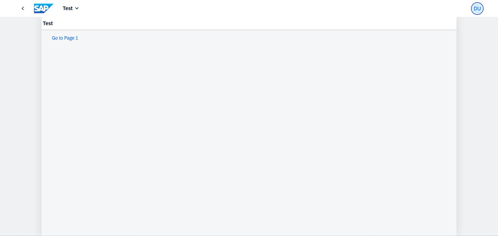

## Application Details
|               |
| ------------- |
|**Generation Date and Time**<br>Sun Aug 10 2025 04:58:05 GMT+0000 (Coordinated Universal Time)|
|**App Generator**<br>SAP Fiori Application Generator|
|**App Generator Version**<br>1.18.4|
|**Generation Platform**<br>SAP Business Application Studio|
|**Template Used**<br>Basic|
|**Service Type**<br>None|
|**Service URL**<br>N/A|
|**Module Name**<br>sapui5bootcamp-test|
|**Application Title**<br>Test|
|**Namespace**<br>com.ui5.test|
|**UI5 Theme**<br>sap_horizon|
|**UI5 Version**<br>1.139.0|
|**Enable Code Assist Libraries**<br>False|
|**Enable TypeScript**<br>False|
|**Add Eslint configuration**<br>False|

## sapui5bootcamp-test

A SAP Fiori Test application.

### Starting the generated app

-   This app has been generated using the SAP Fiori tools - App Generator, as part of the SAP Fiori tools suite.  To launch the generated application, run the following from the generated application root folder:

```
    npm start
```

#### Pre-requisites:

1. Active NodeJS LTS (Long Term Support) version and associated supported NPM version.  (See https://nodejs.org)


##### Additional notes

This is Sprint 1     
This is Sprint 2  
This is Sprint 3  



